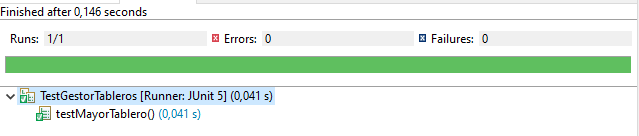

# Práctica 1

Esta práctica es una continuación directa del Laboratorio 1 y se utilizará el mismo proyecto. En el último paso del laboratorio se implementaron los métodos `mayorTablero()` y `getTablerosConPuntuacionMinima(int puntuacion)`. De la teoría de la asignatura se sabe que este tipo de operaciones pueden realizarse de una manera mucho más eficiente si se trabaja con una colección ordenada. En esta práctica se seguirá esta idea para mejorar el rendimiento de los métodos de la clase `GestorTableros`.

**Nota**: Java cuenta con una clase `Collections` que tiene métodos para ordenar listas. Sin embargo, es recomendable que en este punto del curso se implemente algún método de ordenación manualmente para entender bien cómo funciona. Las transparencias de la asignatura tienen ejemplos de cómo implementar los diferentes algoritmos de ordenación que se contemplan en la asignatura.

## Paso 1: Ordenar tableros

En este paso se modificará la clase `GestorTableros` de forma que las búsquedas que se realicen se hagan siempre sobre una lista ordenada. Para ello, hay dos opciones: o bien se ordena la lista en cuanto se crea o bien se ordena la primera vez que se realiza una operación de búsqueda. Cualquiera de las dos opciones es igual de válida y ambas harán uso de un método que ordene la lista. Este método se llamará `ordenarTableros`. Este método debe aplicar alguno de los algoritmos de ordenación que se han visto en la asignatura, idealmente uno que tenga complejidad $O(n log (n))$. 

### Pruebas recomendadas

Para probar que la ordenación es correcta, se puede utilizar el método `sorted` que aparece en las transparencias de la asignatura. Este método recorre el array y comprueba que ninguna pareja de elementos consecutivos está desordenada.

## Paso 2: Actualizar los métodos existentes

Finalmente, se deben actualizar los métodos `mayorTablero` y `getTablerosConPuntuacionMinima` para que hagan uso de la lista ordenada.

### `mayorTablero`

Sabiendo que la lista está ordenada, el tablero con la mayor puntuación será el último tablero de la lista (o el primero si se ha ordenado de mayor a menor). Por lo tanto, el método `mayorTablero` deberá devolver el último tablero de la lista.

### `getTablerosConPuntuacionMinima`

Este método deberá encontrar el índice del primer tablero con una puntuación mayor o igual a la puntuación que se pasa como parámetro. Sabiendo ese indice, el método tiene devolver una sublista que contenga todos los tableros a partir de esa posición.

### Pruebas recomendadas

Es posible utilizar la misma batería de pruebas que en el laboratorio 1 para probar que los métodos `mayorTablero` y `getTablerosConPuntuacionMinima` siguen funcionando correctamente. Sin embargo, es interesante comprobar la mejora de rendimiento que se ha conseguido al trabajar con una lista ordenada. Al ejecutar un test de JUnit es posible comprobar el tiempo que ha tardado en ejecutarse. Se puede comparar el tiempo que tarda en ejecutarse el test con la búsqueda en una colección ordenada con el tiempo que tarda en ejecutarse el test con la búsqueda secuencial en una colección desordenada. Para que esta comparación sea significativa, el método de test deberá ejecutar varias búsquedas.

## Paso 3: Puntuación mediana

Como paso final, se propone implementar un método `getPuntuacionMediana` que devuelva cual es la mediana de la puntuación de los tableros. La mediana es el valor que ocupa la posición central de un conjunto de datos ordenados. Si el número de elementos es par, la mediana es la media de los dos valores centrales. Si el número de elementos es impar, la mediana es el valor central.

### Pruebas recomendadas

- La puntuación mediana de los tableros es 0. Este resultado es esperable ya que en la mayoría de situaciones en una partida de ajedrez ninguno de los bandos tiene una ventaja clara hasta los últimos movimientos.
- Casos límite. Los test unitarios deben servir para comprobar que los métodos evaluados funcionan correctamente en situaciones normales, pero también en situaciones límite. Al trabajar con una lista los casos límite son:
    - Una lista vacía (no se ha definido que pasaría en este caso, pero se puede decidir que el método devuelva 0 o que lance una excepción)
    - Una lista con un solo elemento
    - Una lista con todos los elementos iguales
    - Una lista con un número impar de elementos
    - Una lista con un número par de elementos
  
## Pasos extra (opcionales)

### Porcentaje de tableros desequilibrados

Como se ha podido comprobar al implementar el método `getPuntuacionMediana`, la mayoría de tableros tiene una puntuación cercana a 0. Si este número cambia, significa que uno de los dos bandos tiene ventaja. Se propone implementar un método `getPorcentajeTablerosConVentaja(Bando bando)` que devuelva el porcentaje de tableros en los que el bando pasado como parámetro tiene ventaja. 

### GestorPartidas

Desarrollar una clase `GestorPartidas` que permita gestionar una colección de partidas. Esta clase debería hacer uso de la clase `GestorTableros` y sus métodos. Se propone implementar los métodos:
    - `getPartidasConMayorPuntuacion()` que devuelve una lista con las partidas que contengan el tablero con la mayor puntuación observada.
    - `getPartidasConPuntuacionMinima(int puntuacion)` que devuelve una lista con las partidas que contengan el tablero con una puntuación mayor o igual a la puntuación que se pasa como parámetro.

