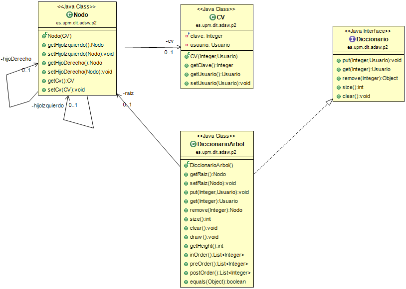
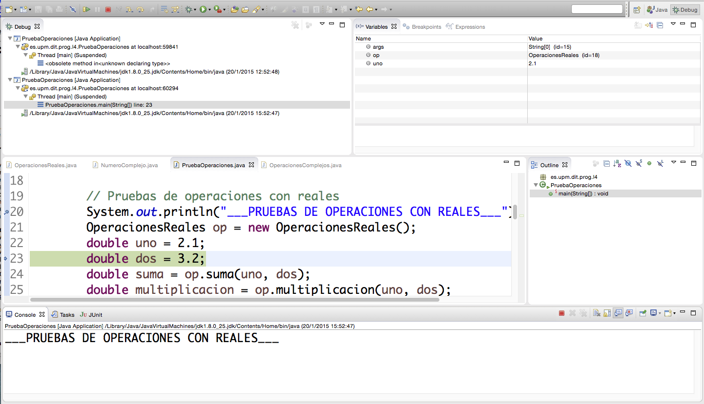
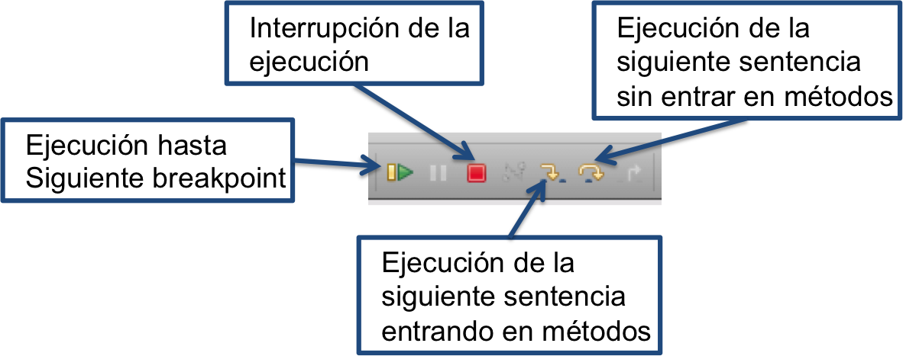

### Análisis y Diseño de Software, 2023

Grado en Ingeniería de Tecnologías y Servicios de
Telecomunicación
ETSI de Telecomunicación
Universidad Politécnica de Madrid


# Práctica 2 - Diccionarios implementados con árboles 📚🌳🔍

El objetivo del laboratorio y práctica 2 consiste en desarrollar un diccionario usando árboles para mejorar la implementación ofrecida por los profesores que consiste en un array desordenado.

En el laboratorio 2 tuvimos que realizar los métodos **put, get, size y clear** de la clase **`DiccionarioArbol`**. Es esta práctica vamos a desarrollar otro conjunto de métodos para acabar su implementación. Primero desarrollaremos un conjunto de métodos para recorrer el árbol **enOrden, postOrden y preOrden**, haremos un método para calcular la altura del árbol **getHeight** y para terminar habrá que implementar el método más complicado de todos: **remove** 🌳💻

Como ya explicamos en el laboratorio, los diccionarios almacenan un par de Clave-Valor. Usaremos la clase **`CV`** para almacenar esa información.

👀¡¡ATENCIÓN!! No confundir con la clase **`ClaveValor`** del paquete `es.upm.dit.adsw.geosocial` 

Como podemos ver en el diagrama de clases, la clave será un **`Integer`** y el valor que vamos a almacenar es un **`Usuario`** 

La clase **`Usuario`** es la misma que en el modelo del laboratorio y práctica 1.

## Objetivos🎯
 
1. Desarrollar la funcionalidad faltante del la clase **`DiccionarioArbol`**

   1.1 Métodos para recorrer el árbol `List<Integer> inOrder()`, `List<Integer> postOrder()` y `List<Integer> preOrder()` 
   
   1.2 Método para calcular la altura de un árbol `public int getHeight()`
   
   1.3 Método para eliminar un nodo por la clave de Usuario `public Nodo remove(Integer clave)`
   
2. Probar nuestro código con las pruebas unitarias funcionales que tenemos en la clase **`DiccionarioArrayDesordenadoTestFuncionales`** y desarrollar más pruebas unitarias si lo estimamos necesario. 

3. ⚠️IMPORTANTE⚠️ Usar el depurador para detectar y corregir errores. Sin usar el depurador👨‍💻 es imposible hacer las prácticas y aprobar ADSW
    
    📝Nota1: Los métodos se pueden desarrollar de manera recursiva o iterativa. Entendemos que hacer los métodos de manera recursiva puede ser más fácil de desarrollar. Pero es decisión del alumno desarrollarlos en el estilo que prefiera.
    
    📝Nota2: el método auxiliar es `private` porque será llamado desde la propia clase, no debe ser visible desde fuera. 
    
    📝Nota3: para entender el funcionamiento de la búsqueda binaria tenemos la [documentación de la asignatura sobre búsqueda binaria](https://moodle.upm.es/titulaciones/oficiales/course/view.php?id=3301#section-2) y también podemos usar la herramienta [VisuAlgo](https://visualgo.net/en/bst) para ver de manera gráfica los algoritmos.

🚨 **La única clase que se debe editar y ampliar es la clase** **`DiccionarioArbol`** 🚨 

🚨 **No se pueden añadir más atributos a las clases `Nodo`, `CV` y `DiccionarioArbol`** 🚨 

Se pueden ampliar los tests con pruebas nuevas, pero no se aconseja modificar las ya existentes.

Se puede modificar la clase **`PruebaInsercionBusqueda`** con fines educativos cuando se haya terminado la práctica para hacer experimentos.

## Diagrama de clases

Los elementos principales de esta práctica son muy similares a los del laboratorio 2, pero como se puede observar aparecen métodos nuevos en la clase **`DiccionarioArbol`**



### 📝🔽 Ejercicio 0: Descargar el código e importarlo en Eclipse 

Se debe descargar el fichero `ADSWP2.zip` del 🌐[repositorio en GitHub](https://github.com/adsw-upm/adsw-laboratorios).🌐
El fichero debe importarse en eclipse mediante la opción `File -> Import -> Existing projects into workspace`, y después seleccionando el fichero `ADSWP2.zip`.

Si todo ha ido bien 🤞. veremos un proyecto con dos paquetes: `es.upm.dit.adsw.p2` y `es.upm.dit.adsw.geosocial`.

Cada uno de los siguientes ejercicios tiene una serie de pruebas asociadas.💻

Si no se ven bien las tildes en los comentarios, cambie la codificación del proyecto a UTF-8. Te colocas encima del proyecto, botón derecho del ratón. `Properties` -> `Text file encoding` -> `Other: "UTF-8"`

### 📝⏱️ Ejercicio 1: Completar la clase `DiccionarioArbol` con los métodos que desarrollamos en el laboratorio 2

La clase **`DiccionarioArbol`** que os proporcionamos no tiene los métodos desarrollados. En el laboratorio 2 desarrollaste los métodos **put, get, size y clear**. 

Debes copiar dichos métodos del laboratorio 2 y pegarlos en la clase **`DiccionarioArbol`**

Comprueba que todo sigue funcionando como antes, ejecutando las pruebas unitarias. Obviamente, deben de funcionar las pruebas unitarias que involucren los métodos anteriores. Las pruebas de los nuevos métodos fallarán hasta que hagas el código.

### 📝🌳Ejercicio 2: Diseñar e implementar los métodos para los recorridos  

Se debe desarrollar en la clase **`DiccionarioArbol`** los métodos `List<Integer> inOrder()`, `List<Integer> postOrder()` y `List<Integer> preOrder()` 

Los tres métodos deben devolver un `List<Integer>`, que es la lista de las claves de los usuarios almacenados en el árbol. Dependiendo del método el orden en el que se encuentran las claves se corresponderá al nombre del método.

### Ejercicio 3: Diseñar e implementar el método  `public int getHeight()` 🌳📏

👨‍💻 Se debe desarrollar en la clase DiccionarioArbol el método `public int getHeight()`

🌳 Este método debe devolver la profundidad del árbol, que es la longitud del camino más largo desde la raíz hasta una hoja del árbol.l.

### Ejercicio 4: Diseñar e implementar el método  `public Nodo remove(Integer clave)`

Se debe desarrollar en la clase **`DiccionarioArbol`** el método `public Nodo remove(Integer clave)`

🔍Este método debe eliminar el nodo del árbol cuya clave del CV sea la clave de entrada.

👀¡¡ATENCIÓN!! Debe devolver el nodo padre del nodo que contiene el objeto CV eliminado, o null si la clave no fue encontrada

### Ejercicio 5: Diseñar e implementar el método  `private boolean equals(Nodo raiz1, Nodo raiz2)`  🌳==🌳❓

Se debe desarrollar en la clase **`DiccionarioArbol`** el método `private boolean equals(Nodo raiz1, Nodo raiz2)`

El método public `boolean equals(Object otroArbol)` ya os lo damos implementado y pero llama a `private boolean equals(Nodo raiz1, Nodo raiz2)` que es el que debes implementar

Debe devolver ✅*true* si el árbol es igual a otro árbol comprobando las claves nodo a nodo y ❌*false* en caso contrario.
Es decir, ambos árboles deben tener las mismas claves colocadas a las mismas alturas. Solo se comprueba si las claves son iguales.

👀¡¡ATENCIÓN!! No cometas el error de pedir a Eclipse que te haga el código de "equals" porque va a fallar, solo comprobará si el atributo *raiz* es idéntico al del otro árbol, pero no todos los hijos, nietos, etc.

### Ejercicio 6: Ejecutar las pruebas unitarias funcionales de la clase `DiccionarioArbolTestFuncionales` 💻🕵️‍♂🌳🐛

En la clase **`DiccionarioArbolTestFuncionales`** tenemos unos métodos de prueba para probar los métodos de la clase **`DiccionarioArbol`** 

Muchas pruebas dependen de varios métodos. P.e. **`testPutAndGet`** depende del método **Put** y el método **Get**. Si falla la prueba, ¿cúal es el método que no funciona? 

Es prácticamente obligatorio usar el depurador para comprobar cuales son los métodos que están fallando. 

Puedes consultar el anexo correspondiente más abajo.👇


### Ejercicio 7: Realizar más pruebas unitarias con JUnit para probar los métodos desarrollados 💻🕵️‍♂

Os hemos proporcionado pruebas unitarias funcionales en la clase **`DiccionarioArbolTestFuncionales`**

Seguramente no sean suficientes, prueba a hacer más pruebas unitarias para detectar los métodos que fallan.

Y por favor, usa el depurador para detectar los errores.


## Anexos:


### Anexo 1: Cargar un proyecto en Eclipse

- Seleccione el menú File > Import > Existing Projects into
  Workspace > Next
- Navegue hasta el archivo zip que contiene el proyecto tal como se ha
  bajado de Moodle.
- Compruebe que el proyecto está marcado, y seleccione Finish

### Anexo 2: Generar y acceder a la documentación con Javadoc en Eclipse

La documentación existente se encuentra en la carpeta *doc* del
proyecto. Para consultarla, abra el fichero *index.html* en un navegador
(botón derecho \> Open with \> Web browser).

También puede consultar la documentación desde una ventana del editor de
código Java. Si posiciona el ratón sobre el nombre de una clase o un
método aparece una ventana auxiliar con un resumen de la documentación.

Si tiene activada la vista *Javadoc* (con Window \> Show View \>
Javadoc), al hacer clic sobre el nombre de un elemento se mostrará la
documentación correspondiente en la ventana correspondiente a esta
vista.

Para generar o actualizar la documentación *javadoc* vaya al menú
Project \> Generate Javadoc. Si aparecen errores de codificación de
caracteres asegúrese de poner las opciones -encoding utf8 -docencoding
utf8 -charset utf8 en el cuadro *VM options* de la tercera ventana que
aparece (después de hacer Next dos veces).

### Anexo 3: Crear una clase de *JUnit*

Sitúese sobre la ventana del editor correspondiente a la clase que
quiere probar y vaya al menú File \> New \> Junit Test Case. Asegúrese
de que está seleccionada la opción "New JUnit Jupiter test", y conteste
afirmativamente si el entorno le pide añadir la biblioteca Junit 5 al
proyecto.

### Anexo 4: Configurar el registrador (*logger*) java.util.logging

#### Opción 1

Los pasos básicos para configurar y usar en un programa son:

-  Importar el paquete

```java
import java.util.logging.*;
```

-  Crear el configurador, que debe ser un atributo de la clase:

```java
static final Logger LOGGER = Logger.getLogger(ListaTrazas.class.getName());
```

-  Configurar el registrador. Ejecutar las siguientes instrucciones en
    el constructor en el que se van a poner los registros:

```java
LOGGER.setUseParentHandlers(false);
handler = new ConsoleHandler();
handler.setLevel(Level.FINEST);
LOGGER.addHandler(handler);
LOGGER.setLevel(Level.FINEST);
```

-  Incluir las trazas donde se considere:

```java
LOGGER.info("Comentario");
LOGGER.fine("La lista: " + this.toString());
```

#### Opción 2

En algunas implementaciones, la opción previa duplica las trazas. A continuación se proporciona otra opción:

-  Importar el paquete

```java
import java.util.logging.*;
```
- Copiar el fichero logging.properties por defecto en un diretorio del usuario. Este fichero se encuentra en el paquete de Java en cada computador. Para facilitar, se adjunta una versión de este fichero en la distribución de este laboratorio. 

- Asignar el nivel por defecto de la consosla a: FINEST

```
java.util.logging.ConsoleHandler.level = FINEST
java.util.logging.ConsoleHandler.formatter = java.util.logging.SimpleFormatter
```

- En el código definir el fichero de configuración que el usuario ha cambiado y crear el gestor de trazas:

```
System.setProperty("java.util.logging.config.file", "/MiDirectorio/logging.properties");
LOGGER = Logger.getLogger(ConfigurarSuma.class.getName());

```
	
- Finalmente, es posible elegir el nivel preferido:

```
	LOGGER.setLevel(Level.FINER);
```


### Anexo 5: Uso del depurador

El depurador permite identificar y eliminar errores de un programa que
compila y ejecuta pero que no produce resultados correctos. El depurador
ejecuta el programa de forma interactiva, permitiendo observar una a una
las instrucciones que se ejecutarán, las variables activas en memoria y
sus valores. Para iniciar el depurador sobre la clase que contiene el
método main marque -Menú: Run-\>Debug

Las herramientas disponibles para el control de la ejecución son varias:

-   **Puntos de parada "*breakpoints".*** Paran la ejecución del
    programa en instrucciones determinadas.
-   **Perspectiva de depuración** con las siguientes vistas:
    -   Vista de visualización y modificación de valores de variables.
    -   Vista de consola que muestra la salida del programa
    -   Vista de editor del código fuente con una línea verde en la
        instrucción que va a ser ejecutada
    -   Vista de depuración indicando la línea de código que va a ser
        ejecutada
    -   Vista de vigilancia de expresiones




    en los métodos (*Step in)* o ejecutando los métodos completos y
    parando al terminar de ejecutarlos (*Step over*).

Para buscar un error en un programa pondremos un punto de parada en la
primera sentencia ejecutable del método main. Iremos ejecutando
controladamente el código entrando en los métodos suma y multiplicación
de la clase Operaciones reales saltando las instrucciones que ejecutan
constructores o llamadas a métodos de clases de la API de Java.

Se observa que las variables *op, uno* y *dos* sólo aparecen en la vista
de variables en memoria tras su declaración. Al entrar en la ejecución
del método *suma* se modifican varias vistas. En la del editor se ve la
clase *OperacionesReales*. En la vista de variables se observan las
variables disponibles por el método suma: la referencia a la propia
instancia, *this*, y los parámetros *dos* y *uno*. Estas variables
contienen los valores pasados al invocar el método. Aunque las variables
tienen los mismos nombres que en la sentencia que invoca al método,
están cambiadas de orden de modo que la variable *dos* contiene el valor
almacenado en la variable *uno* de main. Se puede seguir ejecutando y
salir del método. Se puede ver que los valores de las variables *uno* y
*dos* no han cambiado.

Respecto al ejercicio 2, utilice el depurador para ver qué ocurre y
verificar si se ha producido o no el intercambio de valores deseado.
Para ello se pone otro punto de parada en la sentencia que imprime el
mensaje de cambio de sección. Al ejecutar el programa en modo debug,
éste se parará en el primer punto de parada. Siga la ejecución hasta al
siguiente punto de parada para ya ir instrucción a instrucción. Continúe
con la depuración hasta entender por qué un método funciona y otro no.

En la tercera sección del programa se ejecuta la suma y multiplicación
de dos números complejos. El programa funciona sin problemas, pero no da
el valor adecuado. Debe identificar y corregir los errores usando el
depurador.

[^1]: Un *smoke test* es una prueba elemental de que un programa
    funciona, sin entrar en detalles ni casos particulares.


	Análisis y Diseño de Software, 2023

	Grado en Ingeniería de Tecnologías y Servicios de 
	Telecomunicación 

	ETSI de Telecomunicación

	Universidad Politécnica de Madrid
