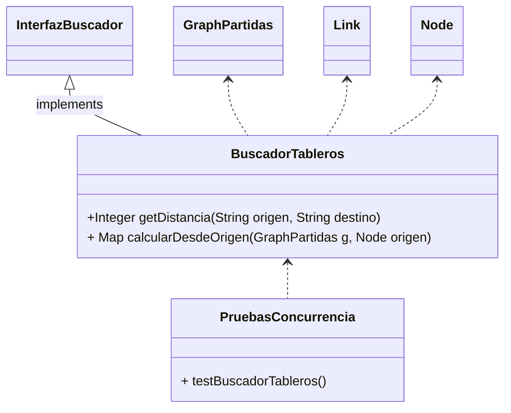
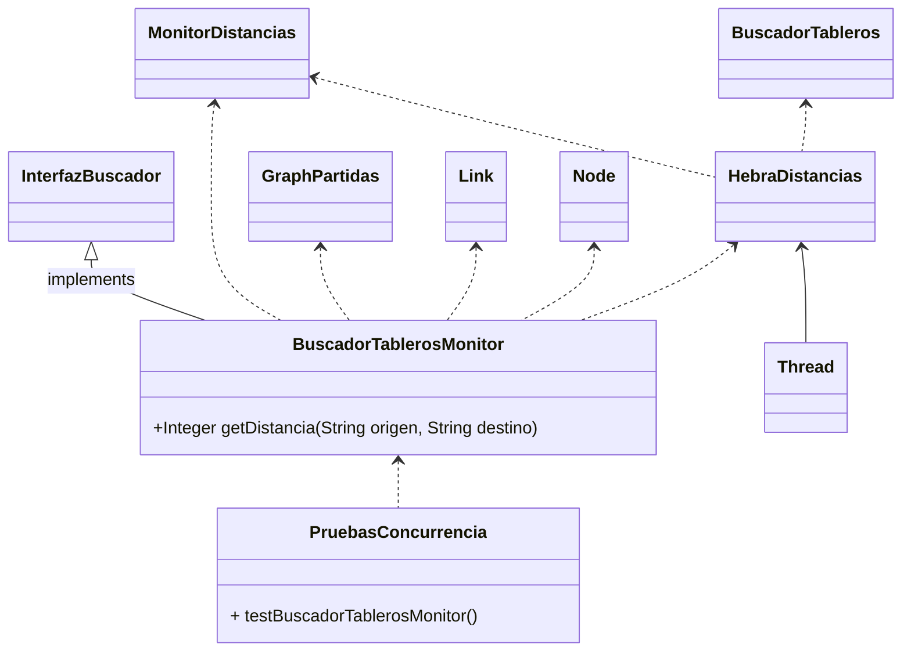
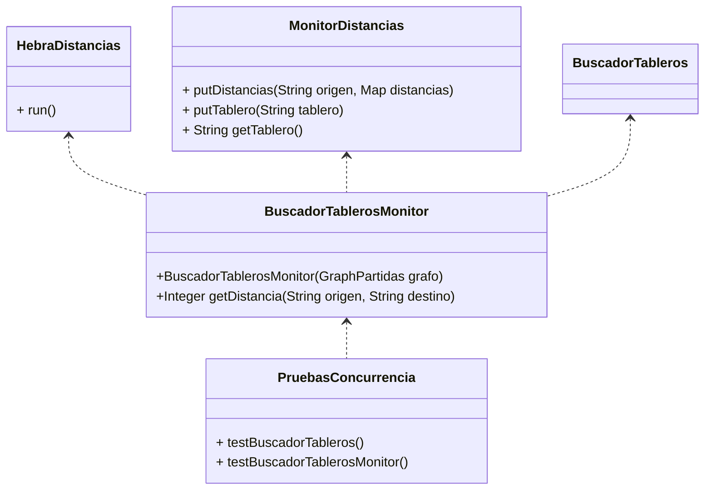

# Práctica 3: Sistema concurrente de cálculo en grafos

## Objetivos

Desarrollar un sistema concurrente, que calcule las distancias entre cualquier par de tableros en un grafo de partidas. El cálculo de las distancias se llevará a cabo mediante un conjunto de hebras en concurrencia. Así puede haber paralelismo cuando varias hebras se ejecutan en varios cores. 

## Requisitos

Para realizar esta práctica es aconsejable haber completado los dos siguientes laboratorios:

* Laboratorio 3
* Laboratorio 4

En este repositorio se proporcionan todos los ficheros necesarios para comenzar la práctica.

## Pasos

### Paso 1: Análisis y evaluación del sistema sin concurrencia 

Antes de desarrollar una solución concurrente, analizaremos una solución secuencial de referencia (`BuscadorTableros`).
Se deben estudiar las siguientes clases y métodos:

Para validar la implementación, se ejecutará el smoketest de `PruebasConcurrencia` (la prueba `testBuscadorTableros`).
No debería haber ningún error.

### Paso 2: Desarrollo del sistema concurrente

En `BuscadorTableros` una única hebra calcula las distancias entre tableros.
Esta ejecución es lenta, sobre todo cuando el número de partidas es elevado.
Para reducir el tiempo de ejecución, una posibilidad es crear varias hebras para calcuar las distancias en paralelo.
Un requisito para el paralelismo es que la computación sea concurrente.
En resumen, nuestra solución estará compuesta de los siguientes clases: 

* `BuscadorTablerosMonitor`: proporciona la misma interfaz que `BuscadorTableros`. El constructor calcula las distancias entre tableros, usando varias hebras.
* `HebraDistancias`: la hebra debe obtener un tablero y calcular la distancia con el resto de tableros, usando el método `calcularDesdeOrigen` de `BuscadorTableros`.
* `MonitorDistancias`: permite el acceso sincronizado de las diferentes hebras a los datos compartidos.

Este es el nuevo diagrama de clases:

En este repositorio se proporcionan los esqueletos de todas las clases necesarias para implementar la solución.

La lógica del sistema se basa en lo siguiente:

El constructor de `BuscadorTablerosMonitor`:
- recibe un grafo como la base para calcular las distancias entre tableros.
- crea una instancia de `MonitorDistancias`, pasando como parámetro el diccionario de distancias.
- tiene que añadir todos los tableros a una instacia de `MonitorDistancias`. Esta clase tiene que conocer cuáles son los tableros ya calculado y los pendientes.
- a continuación, crea las hebras de distancias (inicialmente 4), pasando el monitor y el grafo de tableros.
- espera hasta que todas las hebras hayan completado.

El comportamiento de las hebras es:
- ejecutan continuamente solicitando un tablero invocando a `getTablero`.
- si reciben un `null`, termina su ejecución, porque no hay tableros pendientes.
- en caso contrario, hay que calcular las distancias desde el tablero recibido al resto de los tableros, usando el método `calcularDesdeOrigen`.
- guardan el resultado invocando al método `putDistancias`.

Los datos necesarios se gestionan en `MonitorDistancias`, tanto los tableros pendientes de calcular, como las distancias ya calculadas.

#### Desarrollo de `MonitorDistancias` (a desarrollar)

Este monitor guardará internamente la distancia entre cada par de nodos (usando un diccionario de diccionarios).
También servirá para almacenar y recuperar tableros cuyas distancias aún no se han calculado (tableros pendientes).
Debe publicar los siguientes métodos:

* `putTablero(String tablero)`. Método que añade un origen pendiente de calcular.
* `String getTablero()`. Método para recuperar un tablero de origen cuya distancia aún no se ha calculado.
* `putDistancias(String origen, Map<String, Integer> distancias)`, para actualizar todas las distancias desde un tablero de origen al resto de tableros

#### `HebraDistancias` (a desarrollar)

Estas hebras utilizarán el monitor para obtener tableros cuyas distancias aún no han sido calculadas, calcularán las distancias, y guardarán dichas distancias en el monitor, como se ha descrito previamente.

#### `BuscadorTablerosMonitor` (a desarrollar)

El comportamiento de esta clase se ha descrito previamente. Esta clase  es la principal, debe implementar la interfaz `InterfazBuscador`.

#### Pruebas unitarias

Para validar la implementación, se debe descomentar la prueba `testBuscadorTablerosMonitor` y lanzarla.
Si la implementación es correcta, no debería haber ningún error.

## Pasos opcionales

### Desarrollar `BuscadorTablerosSinBloqueo`

Desarrollaremos una nueva subclase de `BuscadorTableros`, para que el constructor del buscador NO espere a que las hebras hayan calculado la distancia para todos los pares de nodos.
No obstante, las hebras continuarán haciendo el cálculo de las distancias en segundo plano.
Las llamadas a `getDistancia(origen, destino)` deberán bloquear la ejecución (es decir, esperar) hasta que la distancia entre `origen` y `destino` haya sido calculada.

Deberá crearse una nueva clase, `BuscadorTablerosSinBloqueo`, que herede de `BuscadorTableros` e implemente esta funcionalidad.

Para comprobar la implementación, se deben lanzar las pruebas correspondientes en el paquete de test.
¿Se observa alguna diferencia en los tiempos de ejecución de estas pruebas respecto a las de `BuscadorTablerosMonitor`?

### Desarrollar `BuscadorTablerosPerezoso`

Desarrollaremos una nueva subclase de `BuscadorTablerosSinBloqueo` que realizará el cálculo de las distancias de manera perezosa.
Es decir, NO se lanzará ninguna hebra para calcular distancias en el constructor de `BuscadorTablerosPerezoso`.
En su lugar, el método `getDistancias(origen, destino)` deberá identificar que la distancia pedida no está disponible, y utilizar `MonitorDistancias` para pedir que se calculen todas las distancias desde `origen` sean calculadas.
Se bloqueará la ejecución hasta que la distancia haya sido calculada (al igual que en `BuscadorTablerosSinBloqueo`).

Se deben lanzar las pruebas correspondientes en el apquete de test.
¿Se observa alguna diferencia en los tiempos de ejecución frente a `BuscadorTablerosSinBloqueo`?

#### Cancelación 

Implementar el método `terminar` en `MonitorDistancias`, que haga que todas las hebras que están esperando para procesar dejen de hacerlo.

#### Espera máxima en `getDistancia`

Implementar el método `getDistancia(origen, destino, esperaMaxima)`.
Si la distancia entre los dos nodos no está disponible en un tiempo máximo de espera, el método lanzará una excepción.
