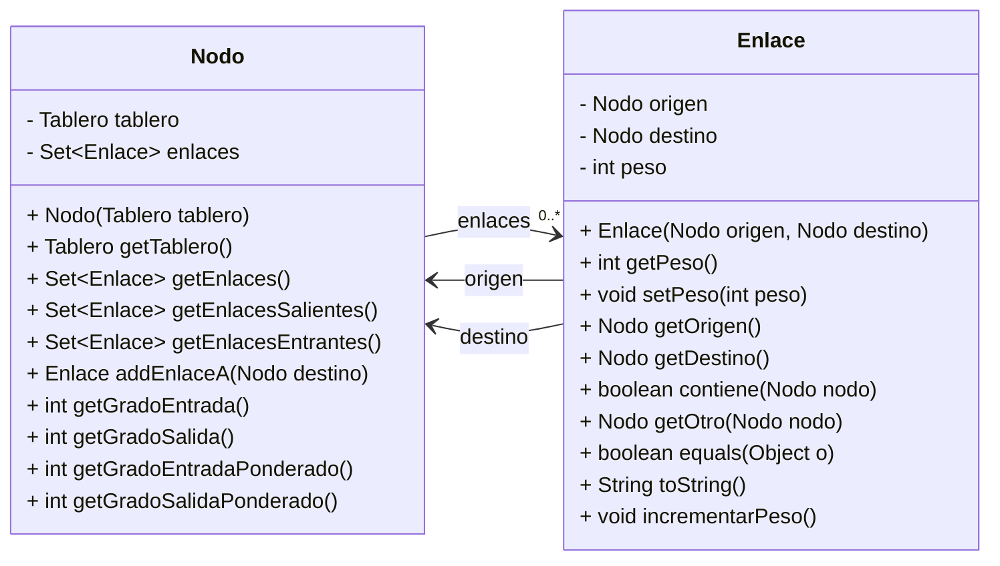

# Práctica 2

En esta práctica continuaremos analizando el conjunto de datos de partidas de ajedrez. En esta ocasión aplicaremos una estructura de datos basada en grafos para analizar las relaciones entre los tableros que tenemos en el fichero `partidas.txt`. Los tableros serán los nodos del grafo y las relaciones entre ellos serán las aristas. En este caso, una relación entre dos tableros significa que hemos visto en alguna partida un movimiento que ha llevado de un tablero a otro. Esto implica que el grafo será dirigido, ya que los movimientos tienen una dirección (de un tablero a otro). También haremos que el grafo sea ponderado, asignando un peso a las aristas que represente el número de veces que se ha observado ese movimiento.

La estructura de la práctica será similar a la de la primera. Comenzaremos creando unos métodos que nos permitirán construir el grafo a partir de los datos del fichero. Luego, añadiremos algunos métodos para realizar consultas generales sobre el grafo. Y finalmente, de forma menos guiada, se pedirá implementar una serie de métodos que permitan realizar consultas más específicas.

## Paso 0: El modelo de datos

En el paquete `modelo` del proyecto hay otro paquete llamado `grafo` que contiene las clases `Enlace.java` y `Nodo.java`. La clase `Nodo` representa uno de los objetos `Tablero` que podemos obtener de los datos. Contiene un atributo `enlaces`, que es un conjunto de objetos `Enlace`. La clase `Enlace` representa una relación entre dos tableros y contiene los atributos `origen` y `destino`, que son objetos `Nodo` y definen el sentido de la relación, así como un atributo `peso` que representa el número de veces que se ha visto el movimiento entre los dos tableros. Antes de comenzar a trabajar con estas clases, es recomendable revisar el código y entender su funcionamiento.



Es recomendable pensar qué forma y qué características tendrá el grafo que construyamos con los datos. Será **dirigido**, ya que los movimientos tienen un sentido (por ejemplo, no podemos hacer retroceder un peón ♙). También será **ponderado**, ya que cada enlace tendrá un peso que representa el número de veces que se ha visto ese movimiento. **Puede tener ciclos** ya que algunas piezas si que pueden hacer su movimiento en varias direcciones ♕. Por último, el grafo será **conexo**, ya que todas las partidas empiezan con el tablero inicial y se ramifican a partir de él. Esto significa que desde el tablero inicial siempre se puede llegar a cualquier otro tablero. Sin embargo, no podemos asegurar que desde cualquier tablero se pueda llegar a cualquier otro. Por ejemplo, un tablero que representa un jaque mate será un nodo que sin enlaces salientes, así que desde él no se podrá llegar a ningún otro tablero. 

## Paso 1: Crear el grafo

Para construir el grafo, trabajaremos sobre la clase `AnalizadorGrafos.java`. El primer paso será definir constructor que reciba una lista de partidas o bien un objeto de la clase `LectorPartidas`. La clase debe contar con al menos estas dos estructuras de datos distintas. La primera será un diccionario con clave `Tablero` y valor el `Nodo` correspondiente. La segunda estructura será una colección de enlaces que nos permita realizar las operaciones de la forma más sencilla posible.

```java
Map<Tablero, Nodo> nodos = new HashMap<>();
TipoDeColección<Enlace> enlaces = new TipoApropiado<Enlace>();
```

El constructor debe recorrer la lista de partidas. En cada partida, procesará los tableros por parejas consecutivas para identificar los movimientos realizados entre ellos. Para cada movimiento, creará un objeto `Enlace` que represente la relación entre los dos tableros. Si el tablero de origen no existe en el grafo, lo creará y lo añadirá al mapa de nodos. Si el tablero de destino no existe, también lo creará y lo añadirá. Luego, añadirá el enlace al grafo y aumentará el peso del enlace si ya existía. Este método puede quedar bastante largo, por lo que es recomendable dividirlo en varios métodos privados que realicen tareas específicas. Por ejemplo, un método que se encargue de añadir un nodo al mapa si no existía previamente, otro que añada los enlaces a las listas de los dos nodos afectados, etc.

## Paso 2: Consultar características del grafo

A continuación se pide implementar una serie de métodos que nos permitan conocer
algunas características relevantes del grafo construido.

### 2.1 Número de nodos

Método que devuelve el número de nodos del grafo. Si lo probamos con el archivo `partidas.txt`, debería devolver 1217330.

### 2.2 Nodo con más enlaces

Método que devuelve el nodo con más enlaces, tanto entrantes como salientes. Esto se conoce como el grado del nodo, es decir, el tablero que más veces ha sido origen o destino de un movimiento. Si existen varios nodos con el mismo número de enlaces, devolverá cualquiera de ellos. Si se prueba con el archivo `partidas.txt`, debería devolver un nodo con 32 enlaces.

> [!IMPORTANT]
> El resultado considera tanto los enlaces entrantes como los salientes. Para que los nodos tengan los enlaces en ambas direcciones es importante añadir cada enlace a los dos nodos que conecta, y siempre teniendo cuidado de no añadir enlaces duplicados. 

## Paso 3: Camino entre dos nodos

El siguiente paso será implementar un método que nos permita calcular el camino entre dos nodos, es decir la secuencia de pasos que llevan desde el tablero origen hasta el destino. Este método debe recibir dos objetos `Nodo` y devolver una lista de objetos `Nodo` que representen el camino entre ellos (incluyendo el nodo de origen y el de destino). Hay muchas formas de implementar esta búsqueda, como por ejemplo:

- [Algoritmo de Dijkstra](https://es.wikipedia.org/wiki/Algoritmo_de_Dijkstra)
- [Búsqueda en anchura (BFS)](https://es.wikipedia.org/wiki/B%C3%BAsqueda_en_anchura)
- [Búsqueda en profundidad (DFS)](https://es.wikipedia.org/wiki/B%C3%BAsqueda_en_profundidad)
- [Algoritmo A*](https://es.wikipedia.org/wiki/A*_search_algorithm)

Cada uno tiene sus ventajas y desventajas. Es recomendable revisarlos y ver cuál se adapta mejor a nuestro escenario. En este caso, BFS y DFS son sencillos de implementar, aunque pueden no ser los más eficientes y debemos tener cuidado con los ciclos. A* es más eficiente, pero su implementación es más compleja. Dijkstra también es eficiente, y su implementación es una de las que se ve en la teoría de la asignatura ([Ejemplo de Dijkstra](https://moodle.upm.es/titulaciones/oficiales/mod/resource/view.php?id=20424)). Deberemos elegir uno de ellos e implementarlo. Nuevamente, es buena idea dividir el código en pequeños métodos que realicen tareas específicas.

> [!TIP]
> ¿Para qué nos sirve este tipo de búsqueda? La búsqueda de caminos mínimos es un problema típico que aparece en muchos ámbitos. En este caso, podríamos utilizarlo para crear un programa que nos permita encontrar la mejor jugada en una partida de ajedrez. Tal y como se ha descrito en la práctica, no estamos utilizando el peso de los enlaces a la hora de calcular los caminos, solo nos interesa el número de movimientos. Sin embargo, podría ser interesante usar estos valores para elegir los caminos menos frecuentes (o lo contrario) si queremos que nuestro programa intete jugadas poco comunes.

## Paso 4: Consultas sobre caminos en el grafo

### 4.1 Camino más corto con enlaces

Este método funciona de manera similar al desarrollado en el paso 2, pero en este caso, en lugar de una lista de objetos `Nodo`, se pide que devuelva una lista de objetos `Enlace`. Es decir, el camino entre los dos nodos representado por los enlaces que los conectan. Este método debe recibir dos objetos `Nodo` y devolver una lista de objetos `Enlace` que representen dicho camino.

### 4.2 Camino de partida

Este método recibe como parámetro una partida y devuelve una lista de objetos `Enlace` que representan el camino entre el primer tablero de la partida (siempre es el tablero inicial) y el último.

Pruebas:
- La partida en la posición 0 del fichero `partidas.txt` debería devolver una lista de 68 enlaces.
- La partida en la posición 500 del fichero `partidas.txt` debería devolver una lista de 43 enlaces.

### 4.3 Partida con mejor ruta

Este método debe recibir como parámetro una partida y devolver un booleano que indique si la secuencia de movimientos realizada es la más corta posible para conectar el tablero inicial con el tablero final.

Pruebas:
- La partida en la posición 0 del fichero `partidas.txt` debería devolver `true`.
- La partida en la posición 202 del fichero `partidas.txt` debería devolver `false`.

### 4.4 Mate en n movimientos

Este método recibe como parámetro un tablero y un número entero `n`. Debe devolver un camino entre ese tablero y otro que represente un jaque mate en como mucho `n` movimientos. Si existen varios caminos, devolverá uno de los que tenga menos enlaces. Si no existe ningún camino, devolverá `null`. Este es el método más complejo de la práctica, y algunos de los casos de prueba propuestos pueden requerir tiempos de cómputo elevados. No nos preocuparemos si el código desarrollado no es capaz de resolver estos casos límite por ahora. En la siguiente práctica veremos cómo utilizar la concurrencia para mejorar el rendimiento de este método.

Pruebas:
- Desde el tablero básico debería encontrarse un mate en 5 movimientos.
- Desde este tablero `r.bqk..rp....p....pppn.p...p..p....P......N.....PPP.PPPPR..QKB.R"` debería encontrarse un mate en 69 movimientos.
  
> [!TIP]
> Podríamos utilizar este método en vez de la puntuación que calculabamos en la práctica anterior, para saber el estado de la partida. Si un jugador puede alcanzar una situación de mate en menos movimientos que su oponente, es probable que esté en una mejor situación. Aún así, esto no es un indicador perfecto, puede que el jugador que tenga el mate más lejano pueda llegar a más situaciones de mate que el otro. Una alternativa a este método sería calcular el número de mates posibles en un número determinado de movimientos (todos los posibles caminos que llevan a un mate). Esto es más complicado, ya que no solo hay que contar los mates, sino también las jugadas que llevan a ellos. 