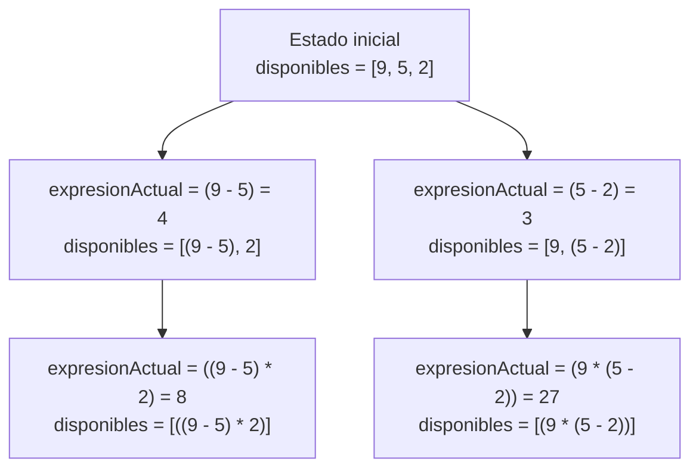

# ADSW Práctica 2: Resolución de Cifras con búsqueda iterativa y expresiones compuestas

## Contexto

En el laboratorio 3 resolvimos la prueba de Cifras construyendo un árbol de estados de forma recursiva y recorriéndolo después para encontrar la mejor solución. En aquella versión, cada expresión se construía combinando la expresión actual del nodo con un único número disponible, siempre de izquierda a derecha.

En esta práctica mejoraremos esa solución con dos cambios clave:

1. **Expresiones compuestas**: en cada paso se podrán combinar *dos expresiones cualesquiera* de la lista de disponibles, no solo la expresión actual con un número suelto. Esto permite construir subexpresiones con paréntesis que luego se reutilizan.

2. **Búsqueda iterativa con actualización inmediata**: en lugar de construir un árbol completo y recorrerlo después, exploraremos el espacio de estados iterativamente, actualizando la mejor solución sobre la marcha.

---

## Glosario

| Término | Significado |
|---|---|
| **Estado** | Una combinación de: una expresión recién construida (`expresionActual`) y la lista de expresiones que quedan por combinar (`disponibles`). |
| **Expresión parcial** | Un objeto `ExpresionParcial` con un valor numérico (`valorActual`) y su representación textual (`expresion`). Puede ser un número suelto (`"3"`) o una subexpresión compuesta (`"(3 + 5)"`). |
| **Nodo** | La representación concreta de un estado, usando la clase `Nodo` del laboratorio anterior. |
| **Disponibles** | Lista de expresiones parciales que aún pueden combinarse entre sí. Cuando se combinan dos, ambas desaparecen y la nueva expresión resultante se añade a la lista. |
| **Mejor expresión** | La `ExpresionParcial` cuyo valor está más cerca del objetivo en cualquier momento de la búsqueda. |

---

## Diferencia fundamental con el laboratorio 3

En el laboratorio 3, las expresiones se construían encadenando operaciones de izquierda a derecha. Por ejemplo, con `[9, 5, 2]`:

```
9 - 5 * 2 = (9 - 5) * 2 = 8
```

Pero no era posible construir:

```
9 * (5 - 2) = 27
```

porque habría requerido primero calcular `(5 - 2)` y después usar ese resultado como operando de `9 * ...`.

En esta práctica sí es posible, porque las subexpresiones vuelven a la lista de disponibles:


```mermaid
flowchart TD
    R["Estado inicial<br/>disponibles = [9, 5, 2]"]

    A["expresionActual = (9 - 5) = 4<br/>disponibles = [(9 - 5), 2]"]
    B["expresionActual = (5 - 2) = 3<br/>disponibles = [9, (5 - 2)]"]

    C["expresionActual = ((9 - 5) * 2) = 8<br/>disponibles = [((9 - 5) * 2)]"]
    D["expresionActual = (9 * (5 - 2)) = 27<br/>disponibles = [(9 * (5 - 2))]"]

    R --> A
    R --> B
    A --> C
    B --> D
```

> **Regla clave**: cada vez que se combinan dos elementos de `disponibles`, ambos se eliminan y la nueva expresión se añade. Por tanto, la lista se reduce en un elemento en cada paso.

---

## Comportamiento esperado

Tu clase `CifrasPractica` debe:

1. Implementar la interfaz `Cifras`.
2. Recibir un objetivo y una lista de números.
3. Explorar combinaciones de pares de expresiones disponibles con los cuatro operadores (`+`, `-`, `*`, `/`).
4. Respetar las restricciones del juego: no se permiten resultados negativos ni divisiones no enteras.
5. Devolver la expresión más cercana al objetivo en formato `"resultado = expresion"`, por ejemplo: `"321 = ((((1 + 5) * 9) * (2 + 4)) - 3)"`.

---

## Clases auxiliares

Reutilizarás las mismas clases del laboratorio 3 sin modificarlas:

**`ExpresionParcial`**: almacena el valor numérico y la representación textual de una expresión.


**`Nodo`**: representa un estado. Tiene una expresión actual, un padre, hijos y una lista de disponibles.

---

## Estructura de la clase `CifrasPractica`

Tu clase tendrá estos métodos. Se describen a continuación, y las tareas te guían para implementarlos uno a uno. Para facilitar la realización de pruebas, vamos a dejar todos los métodos como `public`.

| Método | Propósito |
|---|---|
| `obtenerCifra(int, List<Integer>)` | Punto de entrada. Inicializa el estado y lanza la búsqueda. |
| `buscarSolucion(List<Integer>, int)` | Recorrido del grafo de estados. |
| `generarNodosHijos(Nodo)` | Genera todos los hijos válidos de un estado. |
| `actualizarMejorResultado(ExpresionParcial, int)` | Compara la expresión actual con la mejor solución y la actualiza si procede. |
| `calcularValor(int, String, int)` | Ya implementado en el laboratorio 3. Reutilízalo tal cual. |
| `generarNodosIniciales(List<ExpresionParcial>)` | Crea los nodos iniciales del recorrido a partir de los números dados. |

---

## Tarea 1: `actualizarMejorResultado`

Implementa un método que compare la expresión del nodo actual con la mejor expresión encontrada hasta el momento. Si la expresión actual está más cerca del objetivo, actualiza `mejorExpresion`.

```java
public void actualizarMejorResultado(ExpresionParcial expresion, int objetivo)
```

La distancia al objetivo se calcula como `Math.abs(valor - objetivo)`.

> **Consejo**: añade un `System.out.println` cuando se actualice la mejor solución. Te ayudará a depurar.

---

## Tarea 2: `generarNodosHijos`

Este es el método central de la práctica. A partir de un nodo, genera todos los estados hijo válidos. Para esto, debes combinar cada par de expresiones distintas en `disponibles` con cada operador, respetando las reglas del juego.

```java
public List<Nodo> generarNodosHijos(Nodo nodoActual)
```

### Lógica

Para cada par de expresiones distintas `(exp1, exp2)` en `disponibles`, y para cada operador:

1. Calcula el resultado con `calcularValor`. Si devuelve `-1`, descarta esa combinación.
2. Crea el nuevo nodo:
    * La lista de disponibles del nuevo nodo se construye a partir de la del nodo actual, eliminando `exp1` y `exp2` y añadiendo la nueva expresión compuesta.
    * La expresión actual del nuevo nodo es la nueva expresión compuesta con paréntesis: `"(" + exp1.expresion + " " + operador + " " + exp2.expresion + ")"`.
    * Añade el nuevo nodo a la lista de hijos del nodo actual.
    * Añade el nuevo nodo a la lista de nodos que devolverá el método.

Cuando se procesen todos los pares de expresiones y operadores, devuelve la lista de nodos generados.

### Ejemplo

Si `disponibles = [9, 5, 2]` y eliges `5` y `2` con el operador `-`:

- Nueva expresión: `"(5 - 2)"`, valor `3`.
- Nuevos disponibles: `[9, "(5 - 2)"]`.

---

## Tarea 3: `buscarSolucion`

Este método implementa un **recorrido del grafo de estados**. Cada nodo del grafo es un estado (expresión actual + disponibles) y las aristas conectan un estado con los estados hijos que se generan al combinar dos expresiones.

```java
public void buscarSolucion(List<Integer> numeros, int objetivo)
```

Se proporciona el método `generarNodosIniciales`. Este método recibe una lista de expresiones parciales, cada una con un número de la lista original, y devuelve una lista de nodos iniciales. Cada nodo inicial tiene como expresión actual uno de los números y como disponibles todos los números.
```java
/**
 * Genera nodos iniciales a partir de la lista de expresiones parciales iniciales (números sueltos).
 * @param inicial lista de expresiones parciales iniciales, cada una representando un número suelto.
 * @return lista de nodos iniciales para comenzar la búsqueda.
 */
public List<Nodo> generarNodosIniciales(List<ExpresionParcial> inicial) {
    List<Nodo> nodos = new ArrayList<>();
    for (ExpresionParcial exp : inicial) {
        List<ExpresionParcial> disponibles = new ArrayList<>(inicial);
        nodos.add(new Nodo(exp, null, null, disponibles));
    }
    return nodos;
}
```

El recorrido debe:

1. Partir de los estados iniciales (uno por cada número de la lista), que se crean con `generarNodosIniciales`.
2. Visitar estados, actualizando la mejor solución en cada uno.
3. Expandir cada estado generando sus hijos con `generarNodosHijos`.
4. No visitar el mismo estado dos veces.
5. Terminar cuando se agoten los estados o se encuentre el objetivo exacto.

> **Experimenta**: ¿qué ocurre si los nodos pendientes se guardan en una pila? ¿Y en una cola? ¿Cambia la solución encontrada? ¿Cambia el tiempo de ejecución? ¿Cuál corresponde a un recorrido en profundidad (DFS) y cuál a uno en anchura (BFS)?

---

## Tarea 4: `obtenerCifra`

Integra todo en el método público de la interfaz `Cifras`.

```java
@Override
public String obtenerCifra(int objetivo, List<Integer> numeros)
```

### Lógica

1. Inicializa `mejorExpresion` con el primer número de la lista (como valor por defecto antes de buscar).
2. Llama a `buscarSolucion(numeros, objetivo)`.
3. Devuelve el resultado en formato `"valor = expresion"`.

---

## Casos de prueba sugeridos

| Números | Objetivo | Resultado posible |
|---|---|---|
| `[1, 2, 3, 4, 5, 9]` | `321` | `321 = ((((1 + 5) * 9) * (2 + 4)) - 3)` |
| `[25, 50, 75, 3, 6, 8]` | `979` | No existe solución exacta, devolverá 978 |
| `[100, 7]` | `107` | `107 = (100 + 7)` |
| `[5]` | `5` | `5 = 5` |

---

## Tarea extra (opcional): búsqueda A\*

En las tareas anteriores, el orden en que se visitan los estados depende solo de la estructura de datos (pila o cola). Los estados se exploran "a ciegas", sin tener en cuenta cuáles son más prometedores.

El algoritmo **A\*** mejora esto asignando a cada estado una **prioridad** que estima lo cerca que está de una buena solución. Los estados más prometedores se exploran primero, lo que puede reducir drásticamente el número de nodos visitados.

### Qué debes cambiar

1. Sustituye la colección de pendientes por una `PriorityQueue<Nodo>`.

2. Define una función de prioridad para cada nodo. Una heurística razonable es la distancia al objetivo:

   ```java
   Math.abs(nodo.expresionActual.valorActual - objetivo)
   ```

   Los nodos con menor distancia deben explorarse primero.

3. Para que `PriorityQueue` ordene los nodos, puedes:
   - hacer que `Nodo` implemente `Comparable<Nodo>` (necesitarás acceso al objetivo), o
   - pasar un `Comparator<Nodo>` al constructor de la cola.

### Reflexiona

- ¿Encuentra A\* la solución exacta visitando menos estados que DFS o BFS?
- ¿Qué ocurre cuando no existe solución exacta? ¿Termina antes o después?
- ¿Se te ocurre una heurística mejor que la distancia simple al objetivo?

## Clase de test

A continuación tienes una clase de test con algunos casos básicos. Puedes ampliarla con más casos o usarla como base para tus pruebas.

```java
package es.upm.dit.adsw.cifrasyletras;

import static org.junit.jupiter.api.Assertions.assertEquals;
import static org.junit.jupiter.api.Assertions.assertNotNull;
import static org.junit.jupiter.api.Assertions.assertThrows;
import static org.junit.jupiter.api.Assertions.assertTrue;

import java.util.ArrayList;
import java.util.Arrays;
import java.util.List;

import org.junit.jupiter.api.BeforeEach;
import org.junit.jupiter.api.Test;

import es.upm.dit.adsw.cifrasyletras.cifras.CifrasPractica;
import es.upm.dit.adsw.cifrasyletras.cifras.ExpresionParcial;
import es.upm.dit.adsw.cifrasyletras.cifras.Nodo;

public class CifrasPracticaTest {

    private CifrasPractica cifras;

    @BeforeEach
    void setUp() {
        cifras = new CifrasPractica();
    }

    @Test
    void testCalcularValorOperacionesValidas() {
        assertEquals(15, cifras.calcularValor(10, "+", 5));
        assertEquals(5, cifras.calcularValor(10, "-", 5));
        assertEquals(50, cifras.calcularValor(10, "*", 5));
        assertEquals(2, cifras.calcularValor(10, "/", 5));
    }

    @Test
    void testCalcularValorOperacionesInvalidas() {
        assertEquals(-1, cifras.calcularValor(5, "-", 10));
        assertEquals(-1, cifras.calcularValor(10, "/", 3));
        assertEquals(-1, cifras.calcularValor(10, "/", 0));
        assertEquals(-1, cifras.calcularValor(10, "%", 5));
    }

    @Test
    void testActualizarMejorResultadoActualizaSiMejora() {
        cifras.mejorExpresion = new ExpresionParcial(30, "30");
        cifras.actualizarMejorResultado(new ExpresionParcial(39, "39"), 40);

        ExpresionParcial mejorActual = cifras.mejorExpresion;
        assertEquals(39, mejorActual.valorActual);
        assertEquals("39", mejorActual.expresion);
    }

    @Test
    void testGenerarNodosInicialesCreaUnNodoPorNumero() {
        List<ExpresionParcial> inicial = Arrays.asList(
                new ExpresionParcial(1, "1"),
                new ExpresionParcial(2, "2"),
                new ExpresionParcial(3, "3")
        );

        List<Nodo> nodos = cifras.generarNodosIniciales(inicial);

        assertEquals(3, nodos.size());
        for (Nodo nodo : nodos) {
            assertNotNull(nodo.expresionActual);
            assertEquals(3, nodo.disponibles.size());
        }
    }

    @Test
    void testGenerarNodosHijosGeneraCombinacionesValidas() {
        List<ExpresionParcial> disponibles = new ArrayList<>();
        disponibles.add(new ExpresionParcial(2, "2"));
        disponibles.add(new ExpresionParcial(3, "3"));
        Nodo nodoActual = new Nodo(new ExpresionParcial(0, "0"), null, null, disponibles);

        List<Nodo> hijos = cifras.generarNodosHijos(nodoActual);

        assertEquals(5, hijos.size());
        for (Nodo hijo : hijos) {
            assertEquals(1, hijo.disponibles.size());
            assertTrue(hijo.expresionActual.expresion.startsWith("("));
            assertTrue(hijo.expresionActual.expresion.endsWith(")"));
            assertTrue(hijo.expresionActual.valorActual >= 0);
        }
    }

    @Test
    void testBuscarSolucionEncuentraObjetivoExactoCasoBasico() {
        cifras.mejorExpresion = new ExpresionParcial(100, "100");

        List<Integer> numeros = Arrays.asList(100, 7);
        cifras.buscarSolucion(numeros, 107);

        ExpresionParcial mejorActual = cifras.mejorExpresion;
        assertEquals(107, mejorActual.valorActual);
    }

    @Test
    void testObtenerCifraLanzaExcepcionSiListaEsNull() {
        IllegalArgumentException ex = assertThrows(
                IllegalArgumentException.class,
                () -> cifras.obtenerCifra(100, null)
        );
        assertEquals("La lista de números está vacía", ex.getMessage());
    }

    @Test
    void testObtenerCifraLanzaExcepcionSiListaVacia() {
        IllegalArgumentException ex = assertThrows(
                IllegalArgumentException.class,
                () -> cifras.obtenerCifra(100, new ArrayList<>())
        );
        assertEquals("La lista de números está vacía", ex.getMessage());
    }

    @Test
    void testObtenerCifraCasoTrivialUnNumero() {
        String resultado = cifras.obtenerCifra(5, Arrays.asList(5));
        assertEquals("5 = 5", resultado);
    }

    @Test
    void testObtenerCifraCasoBasicoDosNumeros() {
        String resultado = cifras.obtenerCifra(107, Arrays.asList(100, 7));
        assertTrue(resultado.startsWith("107 ="));
    }
}
```
