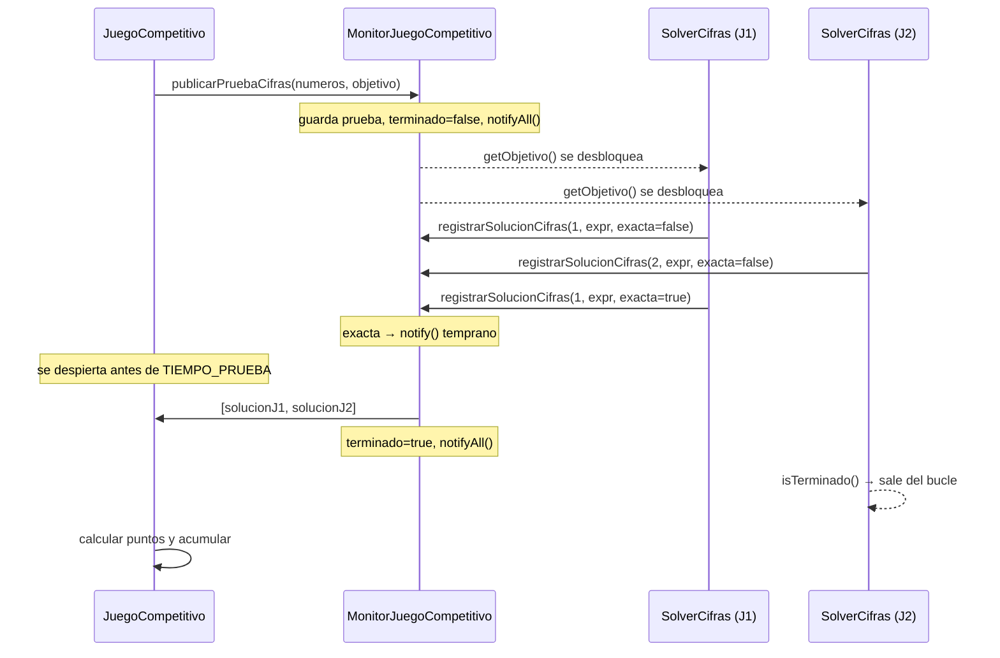

# ADSW Práctica 3: El Concurso de Cifras y Letras

## Contexto

En prácticas anteriores hemos implementado solvers que resuelven automáticamente las pruebas del juego. En el laboratorio 4 aprendimos a ejecutar esos solvers en hilos separados usando un monitor con `synchronized`, `wait` y `notifyAll`.

En esta práctica vamos a simular el formato completo del concurso televisivo **Cifras y Letras**: dos jugadores compiten en paralelo resolviendo las mismas pruebas. El primero en encontrar una solución perfecta termina la ronda antes de que acabe el tiempo; si ninguno lo consigue, gana quien más se haya acercado.

---

## Reglas de puntuación

Las mismas reglas se aplican tanto a la prueba de **cifras** como a la de **letras**:

| Situación | Jugador 1 | Jugador 2 |
|---|:---:|:---:|
| Ambos alcanzan la solución perfecta | 10 | 10 |
| Solo J1 alcanza la perfecta | 10 | 0 |
| Solo J2 alcanza la perfecta | 0 | 10 |
| Ninguno perfecta — J1 mejor resultado | 7 | 0 |
| Ninguno perfecta — J2 mejor resultado | 0 | 7 |
| Ninguno perfecta — misma calidad | 5 | 5 |
| Ninguno ha enviado solución | 0 | 0 |

**Solución perfecta** según el tipo de prueba:

| Prueba | Solución perfecta | Mejor resultado |
|---|---|---|
| **Cifras** | Alcanzar el objetivo exacto | Menor distancia al objetivo |
| **Letras** | Palabra que usa todas las letras disponibles | Palabra más larga |

---

## Resumen de la arquitectura

La práctica se construye sobre tres clases nuevas:

| Clase | Rol |
|---|---|
| `MonitorJuegoCompetitivo` | Monitor central. Coordina los cuatro solvers, gestiona el límite de tiempo y permite terminar la ronda antes de tiempo si algún jugador encuentra la solución perfecta. |
| `JuegoCompetitivo` | Hilo principal. Genera las pruebas, arranca los solvers, recoge las soluciones al final de cada ronda y acumula puntuaciones. |
| Solvers competitivos | Versiones adaptadas de los solvers de la práctica anterior. Envían mejoras al monitor de forma incremental y respetan la señal de terminación. |

El siguiente diagrama muestra el flujo de una ronda de cifras con dos jugadores:



---

## Tarea 1: Implementar el monitor competitivo

`MonitorJuegoCompetitivo` es la clase que coordina la comunicación entre el juego y los cuatro solvers. Trabaja igual que `MonitorJuego` del laboratorio 4, con dos diferencias clave:

- Guarda **dos soluciones** por tipo de prueba (una por jugador).
- Permite **terminar la ronda antes** de que acabe `TIEMPO_PRUEBA` si algún jugador encuentra la solución perfecta, llamando a `notify()` en lugar de esperar pasivamente.

Los métodos que debe tener son:

- `public synchronized String[] publicarPruebaCifras(List<Integer> numeros, int objetivo)`
- `public synchronized String[] publicarPruebaLetras(String letras)`
- `public synchronized int getObjetivo()`
- `public synchronized List<Integer> getNumeros()`
- `public synchronized String getLetras()`
- `public synchronized void registrarSolucionCifras(int jugador, String solucion, boolean exacta)`
- `public synchronized void registrarSolucionLetras(int jugador, String solucion, boolean perfecta)`
- `public synchronized boolean isTerminado()`

Como punto de partida, crea `MonitorJuegoCompetitivo` con el siguiente esqueleto:

```java
import java.util.List;

public class MonitorJuegoCompetitivo {

    public static final long TIEMPO_PRUEBA = 10000;

    private List<Integer> numeros;
    private int objetivo;
    private String letras;

    private String solucionCifrasJ1;
    private String solucionCifrasJ2;
    private String solucionLetrasJ1;
    private String solucionLetrasJ2;

    private boolean terminado;

    public synchronized String[] publicarPruebaCifras(List<Integer> numeros, int objetivo) {
        return null;
    }

    public synchronized String[] publicarPruebaLetras(String letras) {
        return null;
    }

    public synchronized int getObjetivo() {
        return 0;
    }

    public synchronized List<Integer> getNumeros() {
        return null;
    }

    public synchronized String getLetras() {
        return null;
    }

    public synchronized void registrarSolucionCifras(int jugador, String solucion, boolean exacta) {
    }

    public synchronized void registrarSolucionLetras(int jugador, String solucion, boolean perfecta) {
    }

    public synchronized boolean isTerminado() {
        return false;
    }
}
```

Implementación esperada de `publicarPruebaCifras` (y análogamente `publicarPruebaLetras`):

1. Guarda los datos de la prueba (`numeros`, `objetivo`).
2. Limpia las soluciones del turno anterior (`solucionCifrasJ1 = null`, etc.) y pone `terminado = false`.
3. Llama a `notifyAll()` para despertar a los solvers que estén bloqueados en `getObjetivo()` o `getLetras()`.
4. Llama a `wait(TIEMPO_PRUEBA)` para esperar como máximo ese tiempo.
5. Al despertar (ya sea por `notify()` temprano o por expiración del tiempo), pone `terminado = true` y llama a `notifyAll()` para que los solvers que estén en `getObjetivo()` de la siguiente ronda no queden bloqueados indefinidamente.
6. Devuelve un array de la forma `new String[]{ solucionCifrasJ1, solucionCifrasJ2 }`, con la solución del jugador 1 en la primera posición y la del jugador 2 en la segunda. Después, deja el monitor preparado para la siguiente ronda limpiando el estado de las soluciones y de los atributos que emplea ese método (en el caso de Cifras: `numeros` y `objetivo`).

> [!WARNING]
> Ten cuidado con el orden de estas operaciones: si borras `solucionCifrasJ1` y `solucionCifrasJ2` antes de construir el array que vas a devolver, `JuegoCompetitivo` recibirá soluciones nulas.

Implementación esperada de `getObjetivo()` (y análogamente `getLetras()`):

1. Mientras `objetivo <= 0` (o `letras == null`), llama a `wait()`.
2. Devuelve el valor actual.

> El chequeo de `terminado` en `getObjetivo()` es necesario para evitar que un solver quede bloqueado para siempre al final del juego, cuando ya no llegarán más pruebas.

Implementación esperada de `registrarSolucionCifras(int jugador, String solucion, boolean exacta)`:

1. Guarda la solución en `solucionCifrasJ1` o `solucionCifrasJ2` según el `jugador`.
2. Si `exacta` es `true`, llama a `notify()` para despertar al hilo principal antes de que acabe el tiempo.

> Se puede usar `notify()` (no `notifyAll()`), porque solo hay un hilo esperando (el juego principal). 

Por último, haz que `isTerminado` devuelva el valor del atributo `terminado`.

---

## Tarea 2: Implementar el juego competitivo

`JuegoCompetitivo` debe partir de `JuegoConcurrente`, la clase usada en el Laboratorio 4 para coordinar solvers ejecutados en hilos mediante un monitor. La estructura general se mantiene: el juego genera cada prueba, la publica en el monitor, espera las soluciones y muestra el resultado. La diferencia es que ahora hay dos jugadores, por lo que cada ronda devuelve dos soluciones y el juego debe mantener dos puntuaciones acumuladas. Se proporciona la mayor parte del código base de esta clase en el anexo, la tarea consiste en finalizarlo implementando el método de asignación de puntos: `asignarPuntos`. Ese método se basa en los dos siguientes:

```java
private int[] calcularPuntosCifras(String solJ1, String solJ2, List<Integer> numeros, int objetivo)
```

```java
private int[] calcularPuntosLetras(String solJ1, String solJ2, String letras)
```

Cada uno de estos métodos debe invocar a `asignarPuntos` para asignar los puntos de la ronda según la calidad de las soluciones recibidas. La cabecera de `asignarPuntos` es:

```java
private int[] asignarPuntos(boolean perfectaJ1, boolean perfectaJ2, int metricaJ1, int metricaJ2)
```

El método debe calcular los puntos de cada jugador y devolverlos en un array de la forma `new int[]{ puntosJ1, puntosJ2 }`. En ambas pruebas debes aplicar la tabla de puntuación definida al principio de la práctica:

- si ambos jugadores tienen solución perfecta, ambos reciben 10 puntos;
- si solo un jugador tiene solución perfecta, ese jugador recibe 10 puntos y el otro 0;
- si nadie tiene solución perfecta, gana la mejor solución no perfecta y recibe 7 puntos (el otro recibe 0 puntos);
- si nadie tiene solución perfecta y ambos tienen la misma calidad, ambos reciben 5 puntos;
- si ningún jugador ha enviado una solución válida, ambos reciben 0 puntos.

Examina el código de `calcularPuntosCifras` y `calcularPuntosLetras` para entender cómo se determina si una solución es perfecta o no, y qué métrica se emplea para comparar soluciones no perfectas. Luego, implementa `asignarPuntos` siguiendo la tabla de puntuación.

---

## Tarea 3: Adaptar los solvers al modo competitivo

Los solvers del Laboratorio 4 publican una sola solución final. Para el modo competitivo necesitan:

- Un **identificador** (`1` o `2`) para saber en qué ranura del monitor guardar su resultado.
- Enviar soluciones de forma **incremental**: cada vez que encuentren una mejora, la registran en el monitor.
- Comprobar `isTerminado()` para salir del bucle cuando el otro jugador haya encontrado la solución perfecta.

Para cada solver (cifras y letras), copia la clase de la práctica anterior y aplica los mismos cuatro pasos que en el laboratorio 4, más estos cambios adicionales:

**Cambio A.** Añade un atributo `int id` (1 o 2) y recíbelo en el constructor:

```java
public CifrasPracticaCompetitiva(int id, MonitorJuegoCompetitivo monitor) {
    this.id = id;
    this.monitor = monitor;
}
```

**Cambio B.** En lugar de guardar solo la mejor solución al final, el solver debe registrar cada mejora en cuanto la encuentra. En el solver de cifras, dentro del bucle de búsqueda:

```java
boolean exacta = (valorActual == objetivo);
monitor.registrarSolucionCifras(id, textoResultado, exacta);
```

Modifica el bucle para que siga explorando el grafo solo si quedan pendiente y la prueba no ha terminado.

**Cambio C.** Para el solver de letras, reporta cada palabra más larga que encuentres, no solo la final:

```java
if (puedeFormarPalabra(recuentoLetras, recuentoPalabra) && palabra.length() > mejorLongitud) {
    mejorLongitud = palabra.length();
    boolean perfecta = (mejorLongitud == letras.length());
    monitor.registrarSolucionLetras(id, palabra, perfecta);
    if (perfecta) break;
}
```

### Tarea 4: Comprobar el funcionamiento completo

Una vez implementados `MonitorJuegoCompetitivo`, `JuegoCompetitivo` y los solvers competitivos, ejecuta el juego con pocas rondas al principio, por ejemplo 2 o 3 pruebas de letras y 2 o 3 pruebas de cifras.

Comprueba que:

- los cuatro hilos arrancan correctamente;
- cada ronda recibe dos soluciones;
- los puntos se suman al marcador acumulado;
- el juego imprime el resultado final;
- el programa termina sin dejar hilos bloqueados.

---

## Tarea extra (sugerida)

### Mayor dificultad

Aumenta el número de cifras (8–10) o de letras (12–15). Con más cifras, el espacio de estados crece exponencialmente y es muy difícil encontrar la solución exacta en 10 segundos; esto hace que los algoritmos de búsqueda y las estrategias de exploración (DFS vs. BFS) marquen una diferencia real entre los jugadores.

Para hacerlo, basta con cambiar las constantes `NUM_CIFRAS` y `NUM_LETRAS` en `JuegoCompetitivo`, y actualizar el rango del objetivo en consecuencia.

### Soluciones progresivas en letras

Actualmente el solver de letras recorre el diccionario de palabras de mayor a menor longitud, y solo reporta una solución cada vez que encuentra una palabra más larga que la anterior. Esto hace que la primera solución que se registre en el monitor sea la más larga posible, sin embargo, si el número de letras es muy grande, el solver puede tardar demasiado en encontrar la primera solución. Para asegurarnos de que el solver encuentre al menos una solución antes de que acabe el tiempo, podemos modificar el orden de exploración para que recorra el diccionario de menor a mayor longitud. Para no comprobar palabras inecesarias, una vez que se enuentra una palabra válida con 'n' letras, se puede empezar a comprobar solo palabras de longitud mayor a 'n'.

### Competición entre compañeros

Intercambia con un compañero la clase de tu solver (solo el `.java`, sin modificar el monitor ni el juego). Instancia `JuegoCompetitivo` con tu solver como `jugador1` y el solver de tu compañero como `jugador2`, o viceversa. El monitor y el juego son los mismos para ambos; lo único que compite es la calidad del algoritmo de búsqueda.

Para que la comparación sea justa, asegúrate de que ambos solvers implementan `Cifras` y `Letras` y extienden `Thread`, tal como se define en la Tarea 3.


## Anexo: Código base de `JuegoCompetitivo`

```java
package es.upm.dit.adsw.cifrasyletras.juego;

import es.upm.dit.adsw.cifrasyletras.cifras.Cifras;
import es.upm.dit.adsw.cifrasyletras.cifras.CifrasPracticaCompetitiva;
import es.upm.dit.adsw.cifrasyletras.letras.Letras;
import es.upm.dit.adsw.cifrasyletras.letras.LetrasPracticaCompetitiva;

import java.util.ArrayList;
import java.util.List;
import java.util.Random;

public class JuegoCompetitivo {

    private static final int NUM_LETRAS = 9;
    private static final int NUM_CIFRAS = 6;

    private final int pruebasCifras;
    private final int pruebasLetras;

    private final Letras jugadorLetras1;
    private final Letras jugadorLetras2;
    private final Cifras jugadorCifras1;
    private final Cifras jugadorCifras2;

    private final MonitorJuegoCompetitivo monitor;

    private final ValidadorCifrasConParentesis validadorCifras;
    private final ValidadorLetras validadorLetras;

    private int puntosJ1 = 0;
    private int puntosJ2 = 0;

    public static void main(String[] args) {
        MonitorJuegoCompetitivo monitor = new MonitorJuegoCompetitivo();
        JuegoCompetitivo juego = new JuegoCompetitivo(
                3, 3,
                new LetrasPracticaCompetitiva(1, monitor),
                new LetrasPracticaCompetitiva(2, monitor),
                new CifrasPracticaCompetitiva(1, monitor),
                new CifrasPracticaCompetitiva(2, monitor),
                monitor
        );
        juego.jugar();
    }

    public JuegoCompetitivo(int pruebasCifras, int pruebasLetras,
                             Letras jugadorLetras1, Letras jugadorLetras2,
                             Cifras jugadorCifras1, Cifras jugadorCifras2,
                             MonitorJuegoCompetitivo monitor) {
        this.pruebasCifras = pruebasCifras;
        this.pruebasLetras = pruebasLetras;
        this.jugadorLetras1 = jugadorLetras1;
        this.jugadorLetras2 = jugadorLetras2;
        this.jugadorCifras1 = jugadorCifras1;
        this.jugadorCifras2 = jugadorCifras2;
        this.monitor = monitor;
        this.validadorCifras = new ValidadorCifrasConParentesis();
        this.validadorLetras = new ValidadorLetras("data/es.txt");

        if (!(jugadorLetras1 instanceof Thread) || !(jugadorLetras2 instanceof Thread)) {
            System.err.println("Los solvers de letras deben extender Thread");
            System.exit(1);
        }
        if (!(jugadorCifras1 instanceof Thread) || !(jugadorCifras2 instanceof Thread)) {
            System.err.println("Los solvers de cifras deben extender Thread");
            System.exit(1);
        }
    }

    public void jugar() {
        System.out.println("=== COMENZANDO JUEGO COMPETITIVO ===");

        // Arrancar los cuatro hilos
        ((Thread) jugadorCifras1).start();
        ((Thread) jugadorCifras2).start();
        ((Thread) jugadorLetras1).start();
        ((Thread) jugadorLetras2).start();

        System.out.println("Pruebas de letras: " + pruebasLetras);
        System.out.println("Pruebas de cifras: " + pruebasCifras);
        System.out.println();

        jugarPruebasLetras();
        jugarPruebasCifras();

        imprimirResultadoFinal();
        System.exit(0);
    }

    private void jugarPruebasLetras() {
        System.out.println("--- PRUEBAS DE LETRAS ---");
        for (int i = 0; i < pruebasLetras; i++) {
            String letras = generarPruebaLetrasPorFrecuencias();
            System.out.println("\n=== RONDA " + (i + 1) + ": LETRAS ===");
            System.out.println("Letras disponibles: " + letras);

            String[] soluciones = monitor.publicarPruebaLetras(letras);
            String solJ1 = soluciones[0];
            String solJ2 = soluciones[1];

            System.out.println("J1: " + (solJ1 != null ? solJ1 : "(sin solución)"));
            System.out.println("J2: " + (solJ2 != null ? solJ2 : "(sin solución)"));

            int[] puntos = calcularPuntosLetras(solJ1, solJ2, letras);
            puntosJ1 += puntos[0];
            puntosJ2 += puntos[1];

            System.out.println("Puntos esta ronda → J1: " + puntos[0] + ", J2: " + puntos[1]);
            System.out.println("Acumulado → J1: " + puntosJ1 + ", J2: " + puntosJ2);
        }
    }

    private void jugarPruebasCifras() {
        System.out.println("\n--- PRUEBAS DE CIFRAS ---");
        for (int i = 0; i < pruebasCifras; i++) {
            int objetivo = generarObjetivoCifras();
            List<Integer> numeros = generarNumerosCifras();

            System.out.println("\n=== RONDA " + (i + 1) + ": CIFRAS ===");
            System.out.println("Números disponibles: " + numeros + ", objetivo: " + objetivo);

            String[] soluciones = monitor.publicarPruebaCifras(numeros, objetivo);
            String solJ1 = soluciones[0];
            String solJ2 = soluciones[1];

            System.out.println("J1: " + (solJ1 != null ? solJ1 : "(sin solución)"));
            System.out.println("J2: " + (solJ2 != null ? solJ2 : "(sin solución)"));

            int[] puntos = calcularPuntosCifras(solJ1, solJ2, numeros, objetivo);
            puntosJ1 += puntos[0];
            puntosJ2 += puntos[1];

            System.out.println("Puntos esta ronda → J1: " + puntos[0] + ", J2: " + puntos[1]);
            System.out.println("Acumulado → J1: " + puntosJ1 + ", J2: " + puntosJ2);
        }
    }

    /**
     * Calcula los puntos de cada jugador para una prueba de cifras.
     *
     * @param solJ1    solución del jugador 1 en formato "resultado = expresion" (puede ser null)
     * @param solJ2    solución del jugador 2
     * @param numeros  números usados en la prueba
     * @param objetivo valor objetivo
     * @return array {puntosJ1, puntosJ2}
     */
    private int[] calcularPuntosCifras(String solJ1, String solJ2,
                                        List<Integer> numeros, int objetivo) {
        int distJ1 = distanciaCifras(solJ1, numeros, objetivo);
        int distJ2 = distanciaCifras(solJ2, numeros, objetivo);

        return asignarPuntos(distJ1 == 0, distJ2 == 0, distJ1, distJ2);
    }

    /**
     * Calcula los puntos de cada jugador para una prueba de letras.
     *
     * @param solJ1  palabra del jugador 1 (puede ser null)
     * @param solJ2  palabra del jugador 2
     * @param letras letras disponibles en la prueba
     * @return array {puntosJ1, puntosJ2}
     */
    private int[] calcularPuntosLetras(String solJ1, String solJ2, String letras) {
        int lenJ1 = longitudLetras(solJ1, letras);
        int lenJ2 = longitudLetras(solJ2, letras);

        boolean perfectaJ1 = (solJ1 != null && lenJ1 == letras.length());
        boolean perfectaJ2 = (solJ2 != null && lenJ2 == letras.length());

        // Para letras, "mejor" = más larga, así que usamos como distancia la longitud negada
        // (menor distancia = mejor). Aqui adaptamos la logica: mayor longitud gana.
        return asignarPuntos(perfectaJ1, perfectaJ2, -lenJ1, -lenJ2);
    }

    /**
     * Aplica la tabla de puntuacion: perfecta=10, ninguna perfecta y mejor=7, empate=5/5.
     *
     * @param perfectaJ1 si el jugador 1 tiene solucion perfecta
     * @param perfectaJ2 si el jugador 2 tiene solucion perfecta
     * @param metricaJ1  cuanto mas pequena, mejor para J1 (distancia al objetivo, o -longitud)
     * @param metricaJ2  cuanto mas pequena, mejor para J2
     * @return {puntosJ1, puntosJ2}
     */
    private int[] asignarPuntos(boolean perfectaJ1, boolean perfectaJ2, int metricaJ1, int metricaJ2) {
        // Tarea 2: implementar este método siguiendo la tabla de puntuación definida al principio de la práctica
    }

    /**
     * Valida la solucion de cifras y devuelve la distancia al objetivo.
     * Devuelve Integer.MAX_VALUE si la solución es nula o inválida.
     */
    private int distanciaCifras(String sol, List<Integer> numeros, int objetivo) {
        if (sol == null || !validadorCifras.esValida(sol, numeros)) {
            return Integer.MAX_VALUE;
        }
        try {
            int resultado = Integer.parseInt(sol.trim().split("\\s*=\\s*")[0].trim());
            return Math.abs(resultado - objetivo);
        } catch (NumberFormatException e) {
            return Integer.MAX_VALUE;
        }
    }

    /**
     * Valida la palabra y devuelve su longitud. Devuelve 0 si es nula o inválida.
     */
    private int longitudLetras(String sol, String letras) {
        if (sol == null || !validadorLetras.esValida(sol, letras)) {
            return 0;
        }
        return sol.length();
    }

    private void imprimirResultadoFinal() {
        System.out.println("\n==============================");
        System.out.println("=== RESULTADO FINAL ===");
        System.out.println("Jugador 1: " + puntosJ1 + " puntos");
        System.out.println("Jugador 2: " + puntosJ2 + " puntos");
        if (puntosJ1 > puntosJ2) {
            System.out.println("¡Gana el Jugador 1!");
        } else if (puntosJ2 > puntosJ1) {
            System.out.println("¡Gana el Jugador 2!");
        } else {
            System.out.println("¡Empate!");
        }
        System.out.println("==============================");
    }

    // -------- Generadores de pruebas (igual que JuegoConcurrente) --------

    public String generarPruebaLetrasPorFrecuencias() {
        String letrasPonderadas =
                "AAAAAAAAAAAAEEEEEEEEEEEEOOOOOOOOOIIIIIIUUUUSSSSSSSNNNNNNRRRRRRLLLLLDDDDDCCCCTTTTMMMPPPBBGGVYQHFJZXÑ"
                .toLowerCase();
        StringBuilder mano = new StringBuilder();
        Random r = new Random();
        for (int i = 0; i < NUM_LETRAS; i++) {
            mano.append(letrasPonderadas.charAt(r.nextInt(letrasPonderadas.length())));
        }
        return mano.toString();
    }

    public int generarObjetivoCifras() {
        return Math.abs((int) (Math.random() * 899)) + 101;
    }

    public List<Integer> generarNumerosCifras() {
        List<Integer> numeros = new ArrayList<>();
        List<Integer> posibles = new ArrayList<>(List.of(1, 2, 3, 4, 5, 6, 7, 8, 9, 10, 25, 50, 75, 100));
        for (int i = 0; i < NUM_CIFRAS; i++) {
            int n = posibles.get((int) (Math.random() * posibles.size()));
            if (n >= 25) {
                posibles.remove((Integer) n);
            }
            numeros.add(n);
        }
        return numeros;
    }
}
```
